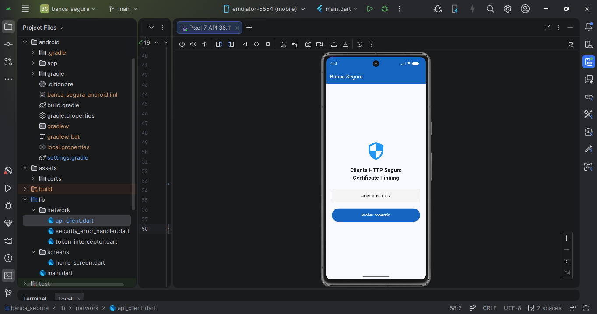
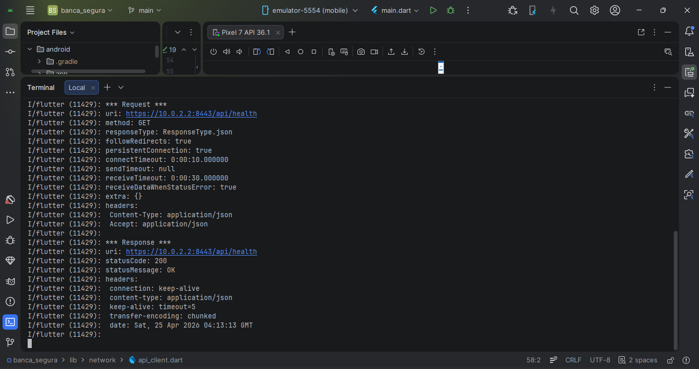
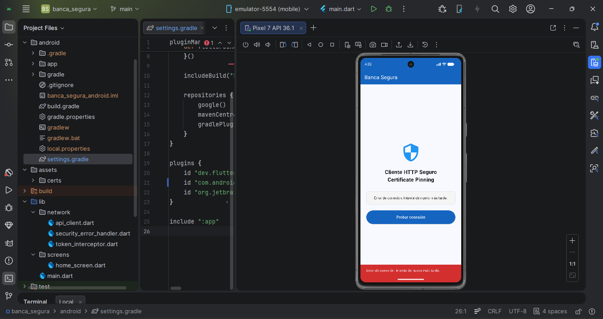
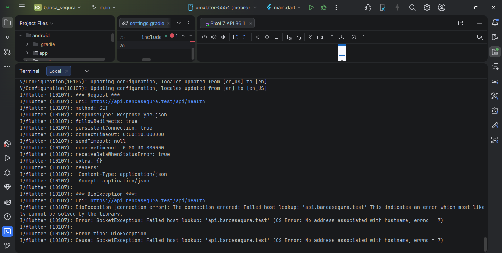
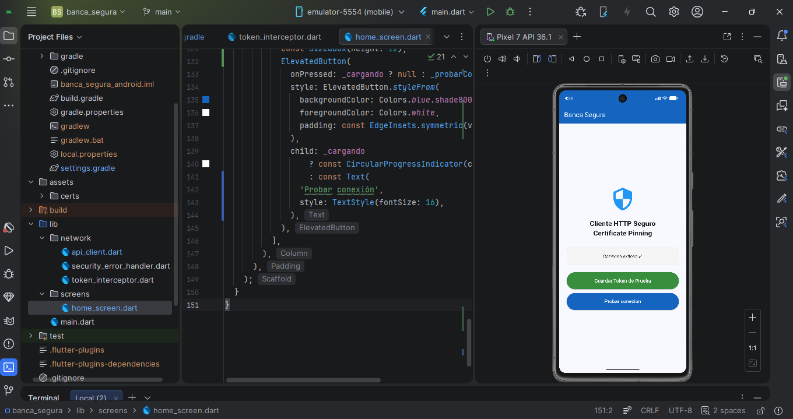
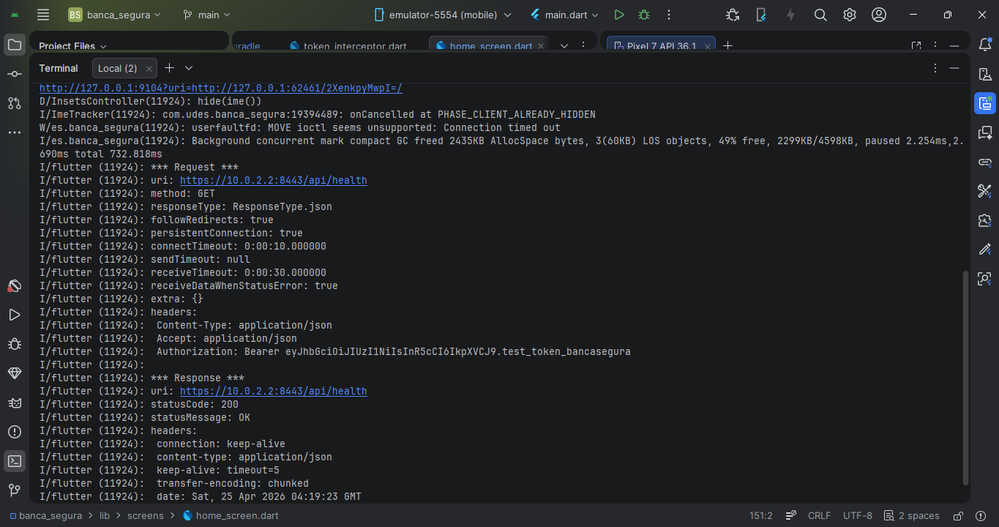

# Banca Segura — Cliente HTTP Seguro con Certificate Pinning

**Unidad 6: Seguridad Móvil y Protección de Información**  
**Post-Contenido 2 — Ingeniería de Sistemas — UDES 2026**

---

## Objetivo

Implementación de certificate pinning en una aplicación Flutter usando Dio como cliente HTTP,
configurando un SecurityContext con certificado propio, manejando errores de handshake TLS
con una experiencia de usuario apropiada, y verificando que la app rechaza conexiones a
servidores con certificados no confiables. El proyecto simula el módulo de red de una app
bancaria móvil.

---

## Estructura del Proyecto
banca_segura/
├── assets/
│   └── certs/
│       └── server_cert.pem       # Certificado público del servidor
├── lib/
│   ├── network/
│   │   ├── api_client.dart           # Cliente HTTP con certificate pinning
│   │   ├── security_error_handler.dart  # Manejo de errores TLS
│   │   └── token_interceptor.dart    # Interceptor de token JWT
│   ├── screens/
│   │   └── home_screen.dart          # Pantalla principal
│   └── main.dart
├── evidencias/
│   ├── checkpoint1_conexion_exitosa.png
│   ├── checkpoint1_log_200.png
│   ├── checkpoint2_snackbar_error.png
│   ├── checkpoint2_log_error.png
│   ├── checkpoint3_conexion_con_token.png
│   └── checkpoint3_log_authorization.png
└── README.md

---

## Prerrequisitos

- Flutter SDK 3.16+
- Android Studio con extensión Flutter/Dart
- Emulador Android API 30+
- OpenSSL (Git Bash en Windows)
- Node.js (para servidor de prueba local)

---

## Paso 1: Generar el Certificado de Prueba

Desde Git Bash en la raíz del proyecto:

```bash
# Crear archivo de configuración con SAN (Subject Alternative Name)
cat > assets/certs/cert.conf << 'EOF'
[req]
distinguished_name = req_distinguished_name
x509_extensions = v3_req
prompt = no

[req_distinguished_name]
CN = api.bancasegura.test
O = BancaSegura
C = CO

[v3_req]
subjectAltName = @alt_names

[alt_names]
DNS.1 = api.bancasegura.test
IP.1 = 10.0.2.2
EOF

# Generar certificado autofirmado
openssl req -x509 -newkey rsa:2048 \
  -keyout assets/certs/server_key.pem \
  -out assets/certs/server_cert.pem \
  -days 365 -nodes \
  -config assets/certs/cert.conf
```

> ⚠️ Solo `server_cert.pem` se sube al repositorio. La clave privada `server_key.pem` está en `.gitignore`.

---

## Paso 2: Levantar el Servidor de Prueba

```bash
node server.js
```

Debe aparecer:
Servidor HTTPS corriendo en https://localhost:8443

---

## Paso 3: Ejecutar la App

```bash
flutter run
```

---

## Flujo de Seguridad Implementado
App Flutter
│
├─► ApiClient (SecurityContext)
│       │
│       ├─► Carga server_cert.pem desde assets
│       ├─► Crea SecurityContext(withTrustedRoots: false)
│       └─► Solo acepta conexiones con ese certificado exacto
│
├─► TokenInterceptor
│       │
│       └─► Lee token de FlutterSecureStorage
│           └─► Agrega header Authorization: Bearer <token>
│
└─► SecurityErrorHandler
│
├─► HandshakeException → Mensaje de certificado no confiable
├─► ConnectionTimeout  → Mensaje de servidor no responde
├─► ReceiveTimeout     → Mensaje de respuesta tardía
└─► 401                → Mensaje de sesión expirada

---

## Evidencias

### Checkpoint 1 — Conexión exitosa con certificado válido
La app establece conexión HTTPS con el servidor local usando el certificado pinneado.
El log de Dio muestra respuesta HTTP 200.




### Checkpoint 2 — Rechazo de certificado inválido
Al conectar con un certificado no confiable, la app lanza HandshakeException
y muestra el mensaje de error apropiado en un SnackBar rojo.




### Checkpoint 3 — Header Authorization en solicitudes
El TokenInterceptor agrega correctamente el header Authorization en cada solicitud HTTP.




---